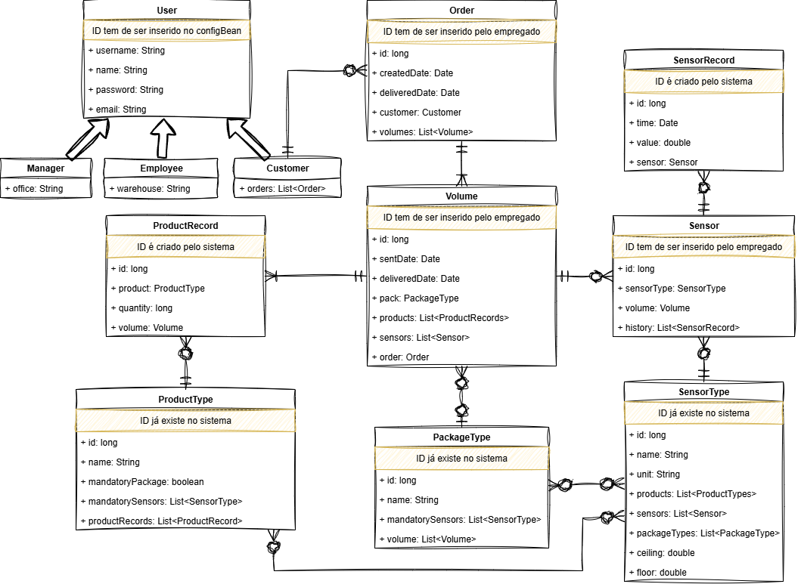
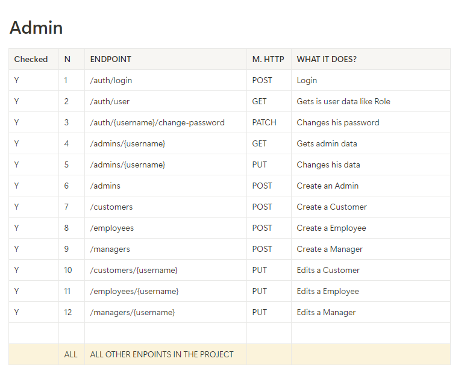
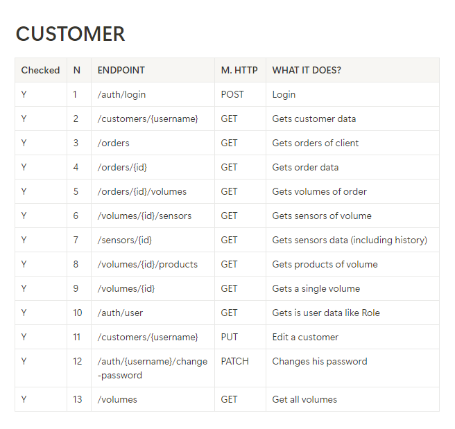
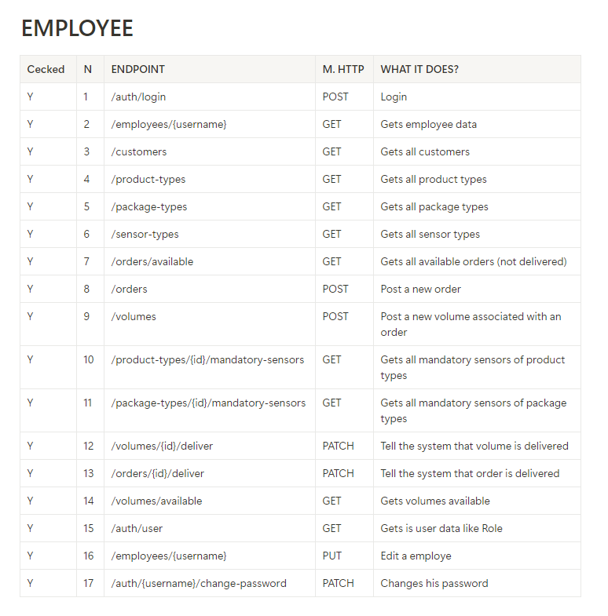
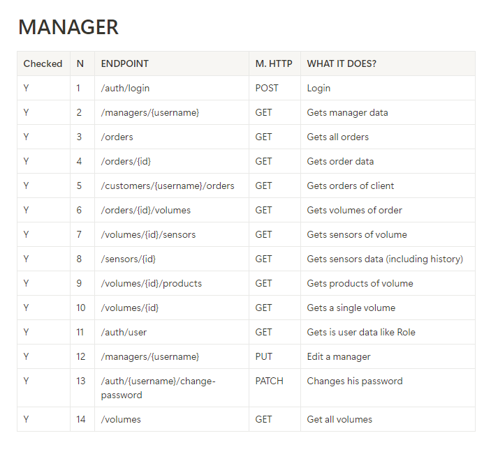
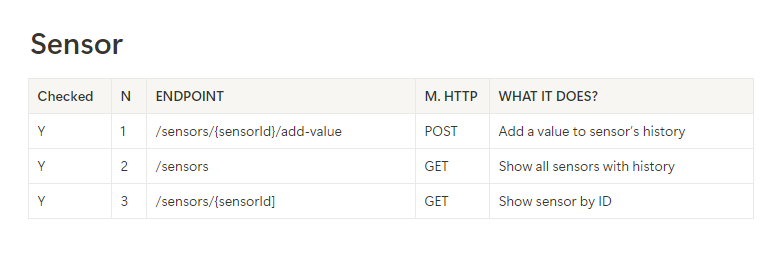

# 📦 Smart Packaging Monitoring Platform


## 📝 Project Description

This project aims to develop an enterprise-grade application for monitoring **smart packaging**, which leverages embedded sensors and wireless connectivity to track parameters such as **temperature**, **pressure**, **acceleration**, and **global positioning** during shipment. The application consists of both **backend** and **frontend** components, enabling seamless communication with the company’s internal systems and providing **real-time data visualization**.


## 🚀 Features

- **🌡️ Sensor Monitoring:** Continuously track sensor data including temperature, acceleration, and global positioning integrated within product packaging.  
- **🔗 Internal System Integration:** Facilitate interaction with XYZ company’s Logistics, Operational Management, and Customer Support systems.  
- **📊 Data Visualization:** Managers can view the latest sensor readings, while customers have access to shipment status and receive alerts in cases of impacts or significant sensor changes.  
- **⏹️ Sensor Deactivation Post-Delivery:** Sensors automatically deactivate once the package is delivered to the customer, ceasing data transmission.


## 🛠️ Technologies Used

- **Backend:** Jakarta EE with RESTful service architecture  
- **Frontend:** Vue.js with Nuxt.js framework  
- **Database:** PostgreSQL  


## 🏗️ Project Structure

- **Backend:** Implements business logic and data access via REST API  
- **Frontend:** Provides user interface for simulation and interaction with both external systems and backend services  


## 📋 Project Requirements & Compliance

The development of this system strictly adheres to the following project constraints:

- **🧩 Self-contained System:**  
  The platform operates independently without relying on any external systems.

- **⚙️ Backend Application:**  
  Implements business logic and data access layers using Jakarta Enterprise Edition, following the REST Service architectural model.

- **🌐 Frontend Application:**  
  Built with web frontend technology capable of consuming REST services, specifically using Vue.js / Nuxt.js as practiced in course labs.

- **🗄️ Database Engine:**  
  Utilizes a GPL/LGPL licensed relational database system, with PostgreSQL chosen as the backend database.

- **🏛️ Architectural Best Practices:**  
  The system is designed using modular architectural patterns including MVC, domain-driven design, ORM techniques for data persistence, lazy loading, and concurrency control, ensuring maintainability and scalability.

This project **fully satisfies** all the above requirements as defined in the project guidelines.


## ⚙️ Setup Instructions

### Prerequisites

- Enable virtualization technology in BIOS (required for Docker)  

### Install MAKE command

1. Open PowerShell as Administrator  
2. Run the following command to install Chocolatey package manager and Make utility:  
   ```powershell
   Set-ExecutionPolicy Bypass -Scope Process -Force;
   [System.Net.ServicePointManager]::SecurityProtocol = [System.Net.ServicePointManager]::SecurityProtocol -bor 3072;
   iex ((New-Object System.Net.WebClient).DownloadString('https://community.chocolatey.org/install.ps1'))
   ```  
3. Close PowerShell  
4. Reopen PowerShell normally  
5. Run:  `choco install make`

### Install Node.js and npm

1. Open Command Prompt  
2. Run:  
   ```powershell
   Set-ExecutionPolicy -Scope Process -ExecutionPolicy Bypass
   choco install nodejs --version="22.18.0"
   node -v  # Should output v22.18.0
   npm -v   # Should output 10.9.3
   ```  
3. Navigate to the frontend application directory:  `cd app/frontend-appmonitor`  
4. Install dependencies:  `npm install`

### Install Apache Maven

1. Download the binary ZIP from [Apache Maven official site](https://maven.apache.org/download.cgi)  
2. Extract and add the Maven `bin` folder to your system `PATH` environment variable (e.g., `C:\apache-maven-3.9.4\bin`)  


## ▶️ How to Run

1. Open a terminal and navigate to the backend directory:  `cd app/backend-appmonitor`  
2. Start the backend services using Make:  `make up` and `make deploy`  
3. Open another terminal in the backend directory and start the frontend:  `npm run start`  
4. Open a browser and access the application at:  [http://localhost:3000](http://localhost:3000)


## 📚 Additional Resources

- **🗒️ Notion Project Documentation:**  
  [https://obsidian-tile-511.notion.site/DAE-Project-152be976b0918097a072ca3b38f074c9?pvs=74](https://obsidian-tile-511.notion.site/DAE-Project-152be976b0918097a072ca3b38f074c9?pvs=74)  

- **🎥 Video Demonstration:**  

  
  
- **🗃️ Database Architecture Diagram:**  

  


 
## 📡 API Endpoints

The platform exposes REST API endpoints grouped by user roles and sensor management. The following diagrams illustrate the available endpoints for each category:

| Role/User       | Endpoints Diagram               |
|-----------------|--------------------------------|
| **👑 Admin**       |  |
| **🙋 Customer**    |  |
| **👷 Employee**    |  |
| **📋 Manager**     |  |
| **📟 Sensor**      |  |


## 📅 Project Details

- **Developed by:**  
  - Joel Bastos (joelsb9)  
  - José Pereira (JosePereira114)  
  - Ana Martins (a0mart)  
  - Tiago Baptista (tiagobaptista1)  

- **Institution:**  
  Polytechnic of Leiria, Portugal

- **Course:**  
  Distributed Applications Engineering (DAE)

- **Degree Program:**  
  Bachelor’s in Software Engineering

- **Project Duration:**  
  Approximately 3 months